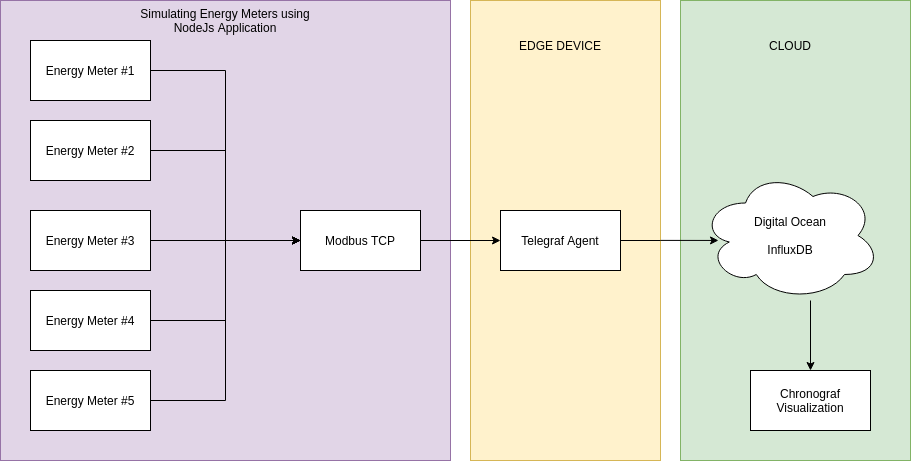
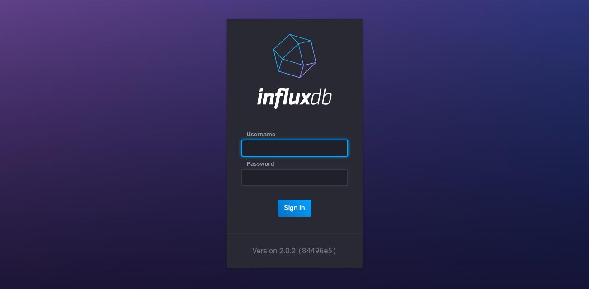
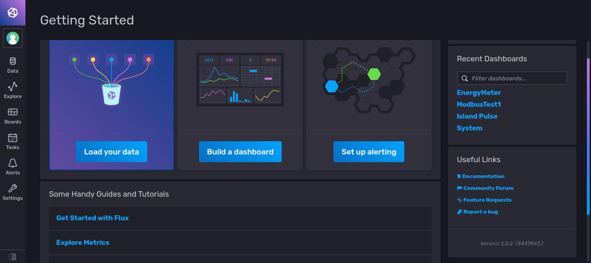
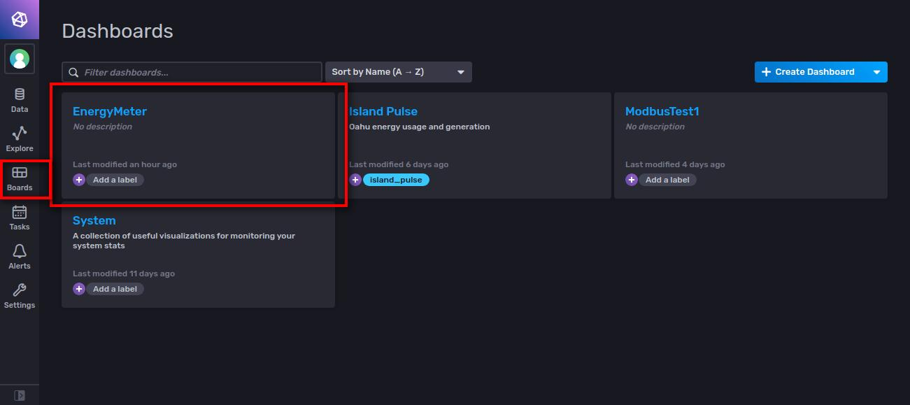
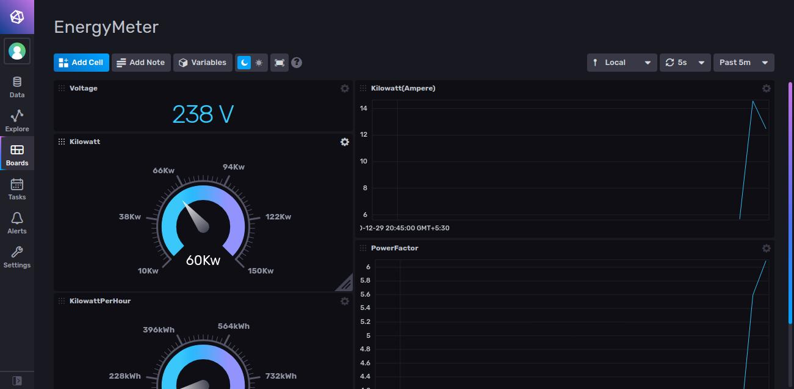
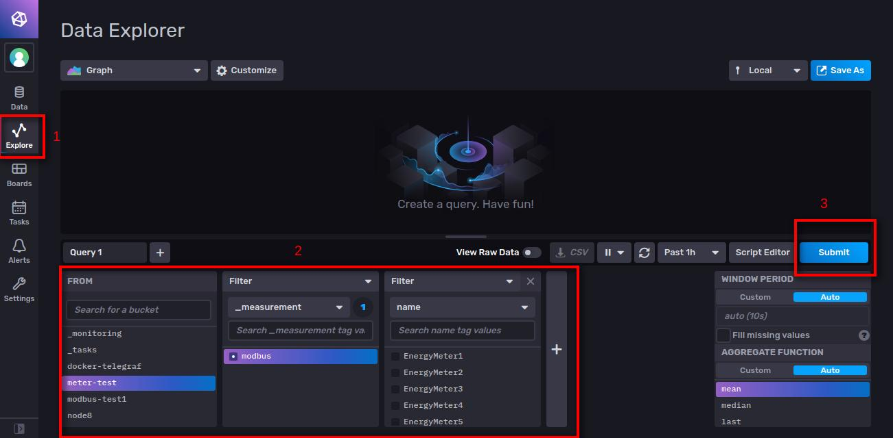

  <h1>Monitor Modbus Devices with InfluxDB</h1>
   
  

    
    

**ABOUT**

Monitor the Modbus devices InfluxDB via Telegraf and visualize the metrics in Chronograf

**WHAT WE ARE GOING TO DO**

We are goind the simulate the energy meters through Modbus TCP connection using NodeJS application.Telegraf agent will collect the metrics from the TCP connection of Modbus and send it to the InfluxDB which is hosted in DigitalOcean Droplet(VM Instance)

**WHAT IS DONE IN THIS PoC**

1. Simualting multiple energy meters using NodeJS application
2. Connecting the Modbus devices to Influx Via Modbus Telegraf Input Plugin
3. Visualizing the Energy meters data in Dashboard(Only one energy meter is shown in the dashboard)

**TO BE DONE / INPROGRESS**

1. Adding a dropdown menu in the dashbaord to show the list of devices connected.
2. On selecting a device only the selected device data/graphs will be shown in the dashbaord
3. Alert the user when the threshold level meets via Telegram

  

## Setup Instructions

### Prerequisites
1. Node.js and NPM
   - We recommend installing using [nvm for Linux/Mac](https://github.com/creationix/nvm) and [nvm-windows for Windows](https://github.com/coreybutler/nvm-windows)

### Installation
1. Telegraf- If telegraf is already installed you can skip this step else install telegraf using [downloads](https://portal.influxdata.com/downloads/)
2. Once telegraf is installed check whether it is running using the command `sudo service telegraf status`.If it is not running then you can run it using the command `sudo service telegraf start`.Now you can check the status again. 

### Configuration

1. Once the repository is cloned to your local machine navigate to the project directory and do install the node packages using the command `npm install`
2. Once the node packages are installed. Open a new terminal(project directory) and run the NodeJs application using the command `npm run start`
3. Open another terminal(Project directory) and now we will run the telegraf with the configuration file which is available in the project directory `modbus.conf`
4. Run the telegraf using the command `telegraf --config /home/nidhin/Desktop/modbus.conf`

*Note*
Makesure the path of the `modbus.conf` file  should from the project directory and not the path mentioned above i.e. `/home/nidhin/Desktop`

Now you could see the telegraf running which will collect the data from the modbus and sent it to `InfluxDB`.

### Opening InfluxDB

* Open the InfluxDB by click the link [Click here to open InfluxDB](http://128.199.28.87:8086/)

  

* Add the credentials which you have received in Email

### Dashboard view

* Once logged in successfully, You could see a screen like below

  

* Click on `Boards` and then select `EnergyMeter` which you could see the screen like below

  

* Now Click the `EnergyMeter` dashboard where you could see the dashboard of EnergyMeter like below

  

### Explore InfluxDB

* If u need to do some queries click on the `Explore` tab on the left side like below

  

* Now Select `EnergyMeter` in the bucket and then `Modbus` and then change the dropdown on the third filter to `name` where you could see the list of devices which is connected in Modbus (EnergyMeter1, EnergyMeter2, ...)

* Now submit the query which will show the graph

## Errors

### 1. Connection Refused in TCP

* While running the `Modbus configuration` in telegraf and if you are getting the error `Connection Refused` stop it and check the following

1. Check whether the node application is running and you could see the logs like `EnergyMeter1 initialized ...`
2. Re run the telegraf configuration command which will connect to the InfluxDB again and start sending the metrics